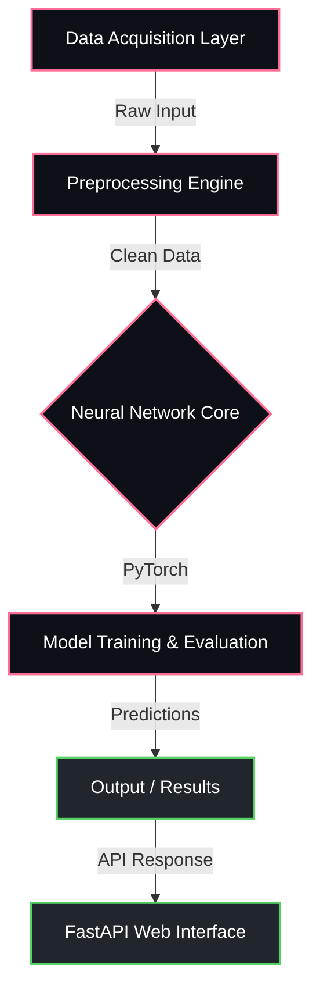

<div align="center">


<p align="center">
  
  
  
  
</p>

  
  
  


</div>

---

## Overview

> Privacy-preserving resource optimization for distributed cloud networks.

**Federated Learning Based Energy Efficient Cloud Resource Allocation** is a proprietary machine learning / ai system engineered by **Karthik Idikuda**. It leverages FastAPI, PyTorch, Flask for its core functionality.

<br/>

## System Architecture



<br/>

## Project Structure

```
Federated-Learning-Based-Energy-Efficient-Cloud-Resource-Allocation/
  .DS_Store
  Dockerfile
  INTERACTIVE_GUIDE.md
  LICENSE
  PROJECT_OVERVIEW.md
  PROJECT_STATUS.md
  README.md
  azure.yaml
  complete_simulation.py
  docker-compose.yml
  __pycache__/
    complete_simulation.cpython-39.pyc
    interactive_prediction.cpython-39.pyc
  config/
    settings.yaml
  docs/
    getting-started.md
  examples/
    basic_example.py
  infra/
    .DS_Store
    main.bicep
    main.json
    main.parameters.json
  results/
    federated_learning_results.png
    simulation_results.json
  scripts/
    setup.bat
    setup.sh
  src/
    .DS_Store
    __init__.py
    config.py
  tests/
  venv/
```

<br/>

## Technical Specifications

| Attribute | Detail |
|:---|:---|
| **Primary Language** | `Python` |
| **Project Category** | `Machine Learning / AI` |
| **Total Source Files** | `1797` |
| **Frameworks** | `FastAPI`, `PyTorch`, `Flask` |
| **Key Dependencies** | `torch` | `scikit-learn` | `pyyaml` | `uvicorn` | `requests` | `seaborn` | `pandas` | `pydantic` | `python-dotenv` | `fastapi` | `flask-cors` | `prometheus-client` | `matplotlib` | `numpy` | `schedule` |
| **Intellectual Property** | `Strictly Proprietary` |

<br/>

## STRICT LEGAL WARNING & LICENSE

> **PROPRIETARY AND CONFIDENTIAL**

This software and all associated documentation are the **exclusive property of Karthik Idikuda**.

- **NO PERMISSION IS GRANTED** to use, copy, modify, merge, publish, distribute, sublicense, or sell copies of this software without explicit, written consent from the author.
- **UNAUTHORIZED USE WILL RESULT IN SEVERE LEGAL ACTION.** Any individual or organization found using, referencing, or deploying this code without paying the required licensing fees will face immediate litigation, financial penalties, and potentially criminal prosecution where applicable by law.
- **TO OBTAIN A LEGAL LICENSE**, you must directly contact Karthik Idikuda to negotiate payment terms.

*By accessing this repository, you acknowledge and accept these strict proprietary terms.*

---

<div align="center">
  
</div>

<!-- TRACKING: S0ktRmVkZXJhdGVkLUxlYXJuaW5nLUJhc2VkLUVuZXJneS1FZmZpY2llbnQtQ2xvdWQtUmVzb3VyY2UtQWxsb2NhdGlvbi1UUkFDSw== -->
